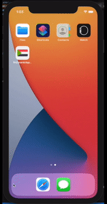
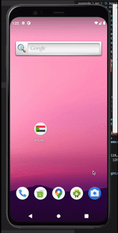
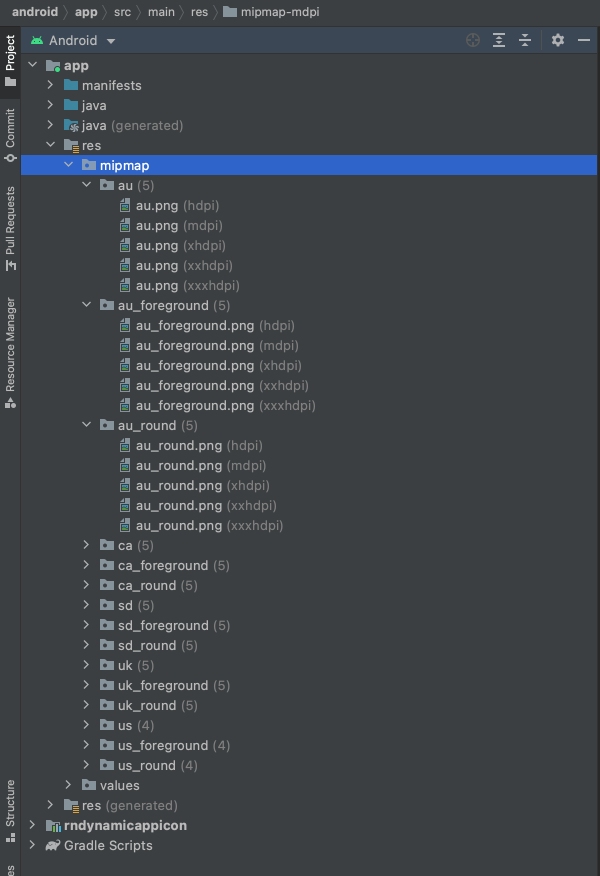
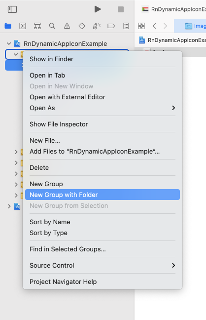
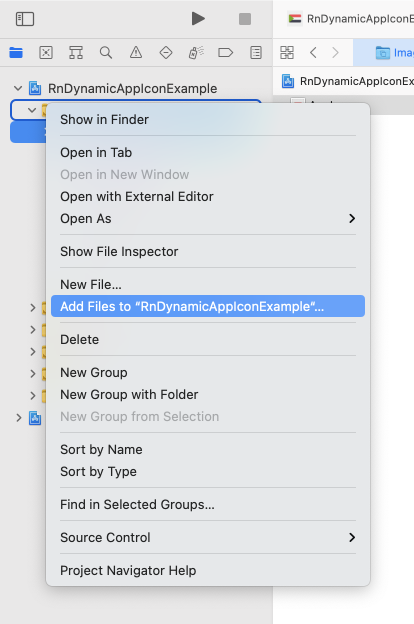
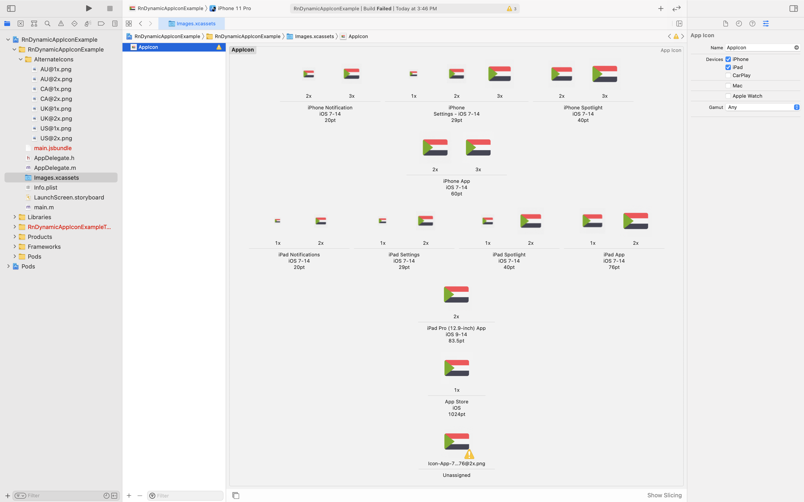
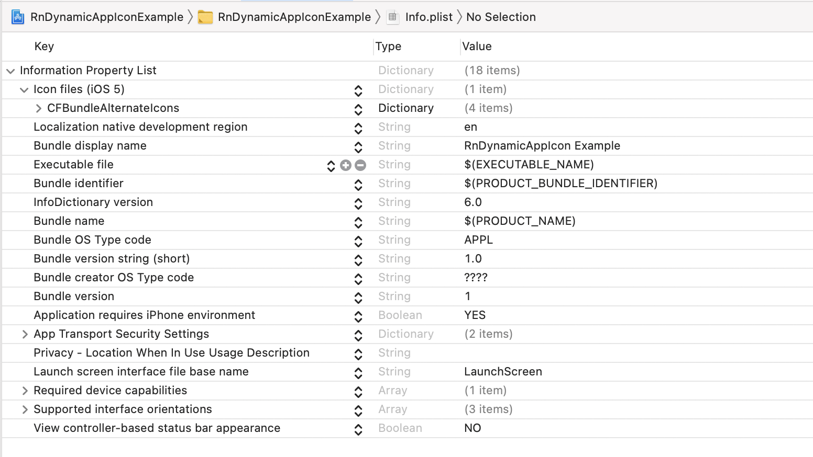

# rn-dynamic-app-icon

  


Programmatically change the app icon in React Native for both android and iOS.

- Add icons to native projects
- Config AndroidManifest.xml and Info.plist
- ✨Magic ✨

| iOS | Android | 
| :---        |    :----:   | 
||| 


## Installation
1. Adding package

NPM:
```sh
npm install rn-dynamic-app-icon
```
YARN:
```sh
yarn add rn-dynamic-app-icon
```
2. iOS specific installation
```sh
cd ios && pod install
```

## Setup
**1. Android**
1. Add all the icons you need inside your project's `android/app/src/main/res/mipmap-*` directories:



2. Add the alternate icons in the **AndroidManifest.xml** file:

```xml
<manifest xmlns:android="http://schemas.android.com/apk/res/android"
  package="com.example.rndynamicappicon">
  <uses-permission android:name="android.permission.INTERNET" />
  
  <application
    android:name=".MainApplication"
    android:allowBackup="false"
    android:icon="@mipmap/sd"
    android:label="@string/app_name"
    android:roundIcon="@mipmap/sd_round"
    android:theme="@style/AppTheme">
    <activity
      android:name=".MainActivity"
      android:configChanges="keyboard|keyboardHidden|orientation|screenSize|uiMode"
      android:label="@string/app_name"
      android:launchMode="singleTask"
      android:windowSoftInputMode="adjustResize">
      <intent-filter>
        <action android:name="android.intent.action.MAIN" />
        <category android:name="android.intent.category.LAUNCHER" />
      </intent-filter>
    </activity>
    <activity android:name="com.facebook.react.devsupport.DevSettingsActivity" />

    <activity-alias
      android:name=".MainActivityAU"
      android:enabled="false"
      android:icon="@mipmap/au"
      android:roundIcon="@mipmap/au_round"
      android:targetActivity=".MainActivity">
      <intent-filter>
        <action android:name="android.intent.action.MAIN" />
        <category android:name="android.intent.category.LAUNCHER" />
      </intent-filter>
    </activity-alias>

    <activity-alias
      android:name=".MainActivityCA"
      android:enabled="false"
      android:icon="@mipmap/ca"
      android:roundIcon="@mipmap/ca_round"
      android:targetActivity=".MainActivity">
      <intent-filter>
        <action android:name="android.intent.action.MAIN" />
        <category android:name="android.intent.category.LAUNCHER" />
      </intent-filter>
    </activity-alias>

    <activity-alias
      android:name=".MainActivityUK"
      android:enabled="false"
      android:icon="@mipmap/uk"
      android:roundIcon="@mipmap/uk_round"
      android:targetActivity=".MainActivity">
      <intent-filter>
        <action android:name="android.intent.action.MAIN" />
        <category android:name="android.intent.category.LAUNCHER" />
      </intent-filter>
    </activity-alias>

    <activity-alias
      android:name=".MainActivityUS"
      android:enabled="false"
      android:icon="@mipmap/us"
      android:roundIcon="@mipmap/us_round"
      android:targetActivity=".MainActivity">
      <intent-filter>
        <action android:name="android.intent.action.MAIN" />
        <category android:name="android.intent.category.LAUNCHER" />
      </intent-filter>
    </activity-alias>

  </application>
</manifest>
```
The main point is to create <activity-alias> tags to make more alternate icons. While the tag name should be your applications initial Activity name suffixed by you icon definition name example: .MainActivityAU 
**NOTE: Default icon will have the initial Activity's name, example: .MainActivity**


---
**2. iOS**
1. Open you project in XCode and create a new group with folder and add you icons there, see image below:



2. Include alternate icons by selecting add files option, which supports Icon@2x.png format, see image below:



3. Add default icon set to Images.xcassets folder, now project structure should be as the image below:



4. Now all you need to do is configure **Info.plist**, follow the example below, make sure you are setting the icon name **Exactly as the file name (without "@2x.png)**
```xml
<key>CFBundleIcons</key>
<dict>
	<key>CFBundleAlternateIcons</key>
	<dict>
		<key>AU</key>
		<dict>
			<key>CFBundleIconFiles</key>
			<array>
				<string>AU</string>
			</array>
		</dict>
		<key>CA</key>
		<dict>
		    <key>CFBundleIconFiles</key>
			<array>
				<string>CA</string>
			</array>
		</dict>
		<key>UK</key>
		<dict>
			<key>CFBundleIconFiles</key>
			<array>
				<string>UK</string>
			</array>
		</dict>
		<key>US</key>
		<dict>
			<key>CFBundleIconFiles</key>
			<array>
				<string>US</string>
			</array>
		</dict>
	</dict>
</dict>
```
Now the **Info.plist** file should look as follows:


## Usage
```js
import {
    changeIcon, 
    WhenToKillOldClasses, //Optional: import this only if you need it
} from 'rn-dynamic-app-icon';

// Pass the name of icon to be enabled
changeIcon('US');

// Pass an empty string to enable default icon
changeIcon('');

// Android ONLY (OPTIONAL)
// extraParams object to customize the icon change behavior
//  1. customPackage
// Usage: to pass a custom launcher activity name: 
changeIcon('AU', {customPackageName: activityName});
//  2. whenToKillOldClasses
// Usage: define when to kill old icon class
/**  Available options:
    - WhenToKillOldClasses.ON_ACTIVITY_PAUSED (Default)
    - WhenToKillOldClasses.ON_ACTIVITY_STOPPED
    - WhenToKillOldClasses.ON_ACTIVITY_DESTROYED
*/
changeIcon('UK', {whenToKillOldClasses: WhenToKillOldClasses.ON_ACTIVITY_DESTROYED});
```


## Special thanks
> To @skb1129 for his work on a similar project which inspired me to implement this package with a bit of enhancements on both android and ios

> To freepik, since all of the icons used in this projects are made by https://www.freepik.com
